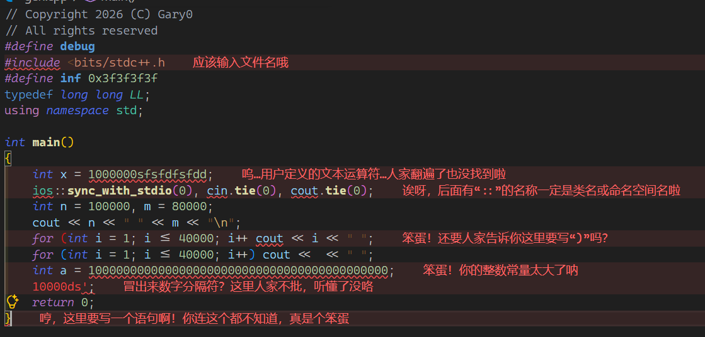

かわいい！

[Github](https://github.com/Gary-0925/kawaii-vscode-cpptools/blob/main/README.md) | [洛谷](https://www.luogu.com.cn/article/j8i1xug0)

## 让 VScode 中的 C\C++（ms-vscode.cpptools）扩展的报错提示变得可爱！

> 本文中内容在 ms-vscode.cpptools-1.34.4-win32-x64 中测试可用，不能保证对于任意版本的 C\C++ 扩展都可用。后续如果在新版本扩展中失效了将会更新。

### 1. 安装扩展

如果您还没有在 VScode 中安装 C\C++ 扩展，请在 VScode 的「扩展」选项卡中搜索“ms-vscode.cpptools”，并安装搜索得到的 C\C++ 扩展。

### 2. 下载报错提示文件

1. 打开 [Github 下载链接](https://raw.githubusercontent.com/Gary-0925/kawaii-vscode-cpptools/refs/heads/main/src/zh_CN/messages.json)，按下 Ctrl+S 保存为 `messages.json`。

2. 如果 Github 无法打开，也可以使用洛谷下载。打开[洛谷下载链接](https://www.luogu.com.cn/problem/U700666/attachment/dooox7k0)，将会自动下载 `messages.json`。

### 3. 打开 C\C++ 扩展的目录

打开「扩展」选项卡，选中 C\C++ 扩展，点击“大小”字样右侧的蓝色字体，如下图所示：

此时应该已经打开了个形如 `C:\Users\XXX\.vscode\extensions\ms-vscode.cpptools-XXX` 的目录，进入该目录下的 `\bin\zh-cn` 文件夹。

### 4. 替换错误提示文件

当前目录下应该有一个叫做 `messages.json` 的文件，建议先将这个文件备份，再使用之前下载的 `messages.json` 替换这个文件。

### 5. 重启扩展

回到「扩展」选项卡，右键 C\C++ 扩展，点击「禁用」。现在如果显示“所有扩展都需要重启后才能应用更新。”，点击「重启扩展」。之后再右键 C\C++ 扩展，点击「启用」。

现在，打开一个包含语法错误的 C\C++ 文件，应该可以看到报错提示变得可爱了。

如果无效，请尝试重启 VScode。

如果仍然无效，上文中方法可能已经失效，请使用之前备份的原版 `messages.json` 替换回来。

配合 `usernamehw.errorlens` 扩展食用效果更佳：

### 特别鸣谢

本项目的灵感来自 [kawaii-gcc](/Bill-Haku/kawaii-gcc) 项目。为了让可爱的报错可以伴着我们编写代码，我创建了本项目。十分感谢原作者的分享和开源精神。